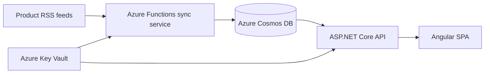

# Microsoft Cloud & AI Platform Updates

A web application that brings product news from the Microsoft Cloud and AI ecosystem into one filterable, paginated feed. It currently aggregates updates from Azure, Microsoft Foundry, Fabric, Microsoft 365 Copilot, and GitHub.

**Live demo:** [MS Cloud & AI Platform Updates](https://msupdates.zongyi.me/)

## Architecture



- **Angular (v22) SPA** displays and filters updates and supports light and dark themes.
- **ASP.NET Core API (v10)** reads paginated updates from Cosmos DB.
- **Azure Functions worker** polls the upstream RSS feeds at startup and every day at 00:00 and 12:00 UTC.
- **Azure Cosmos DB** stores the normalized update records.
- **Azure Key Vault** supplies the Cosmos DB connection settings to both backend services.
- **Application Insights** monitors the API's performance and usage.

## Repository Structure

```text
src/
|-- backend/
|   |-- MS-Updates/          # ASP.NET Core minimal API
|   |-- MS-Updates.Func/     # Azure Functions RSS ingestion worker
|   |-- MS-Updates.Tests/    # xUnit tests
|   `-- MS-Updates.slnx
`-- spa/
    `-- ms-updates/          # Angular application
```

## Prerequisites

- [.NET 10 SDK](https://dotnet.microsoft.com/download/dotnet/10.0)
- [Node.js](https://nodejs.org/)
- [Angular](https://angular.dev/overview)
- [Azure CLI](https://learn.microsoft.com/cli/azure/install-azure-cli)
- Access to the `kv-ms-updates` Azure Key Vault and its Cosmos DB secrets

## Configuration

Both backend projects use `DefaultAzureCredential` to access the `kv-ms-updates` Key Vault. Sign in before running them locally:

```powershell
az login
```

The signed-in identity needs permission to read these Key Vault secrets:

| Secret | Purpose |
| --- | --- |
| `CosmosConnection` | Cosmos DB connection string |
| `CosmosDb` | Database name |
| `CosmosContainer` | Container name |
| `AppInsightsConnection` | Application Insights connection string |

The API reads the Key Vault name from `src/backend/MS-Updates/appsettings.json`. The Functions project currently uses `kv-ms-updates` directly in its secret manager.

The development SPA currently calls the deployed API. To use a local API, change `apiEndpoint` in `src/spa/ms-updates/src/environments/environment.development.ts` to:

```ts
apiEndpoint: 'https://localhost:7048'
```

Trust the local ASP.NET Core development certificate if necessary:

```powershell
dotnet dev-certs https --trust
```

## Run Locally

### 1. Restore and run the API

From the repository root:

```powershell
dotnet restore src/backend/MS-Updates.slnx
dotnet run --project src/backend/MS-Updates/MS-Updates.csproj --launch-profile https
```

The API is available at `https://localhost:7048` and `http://localhost:5197`.

### 2. Run the SPA

In another terminal:

```powershell
Set-Location src/spa/ms-updates
npm install
ng serve
```

Open `http://localhost:4200`.

## API

### List updates

```http
GET /api/ms-updates?source={source}&pageIndex={pageIndex}&pageSize={pageSize}
```

| Parameter | Required | Default | Description |
| --- | --- | --- | --- |
| `source` | No | All sources | Filters by update source |
| `pageIndex` | No | `0` | Zero-based page index |
| `pageSize` | No | `12` | Number of records per page |

Known source values are `Azure`, `Microsoft Foundry`, `Microsoft Copilot 365`, and `GitHub`.

Example:

```powershell
Invoke-RestMethod 'https://localhost:7048/api/ms-updates?source=Azure&pageIndex=0&pageSize=12'
```

## Build and Test

Run the backend tests:

```powershell
dotnet test src/backend/MS-Updates.slnx
```

Build and test the SPA:

```powershell
Set-Location src/spa/ms-updates
npm run build
npm test
```

## Deployment

The repository includes the pieces needed for the current Azure-hosted architecture:

- The SPA includes an Azure Static Web Apps configuration file.
- The API includes a Linux Dockerfile and is suitable for a container host such as Azure Container Apps.
- The ingestion worker targets Azure Functions v4 using the isolated .NET worker model.
- Application Insights telemetry is enabled for the Functions worker when `APPLICATIONINSIGHTS_CONNECTION_STRING` is set.

Before deploying to a new environment, update the SPA API endpoint, API CORS origins, Key Vault name, and Azure resource access policies for that environment.